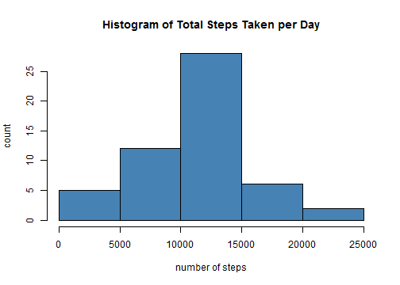
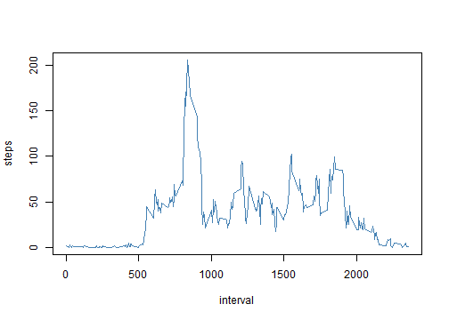
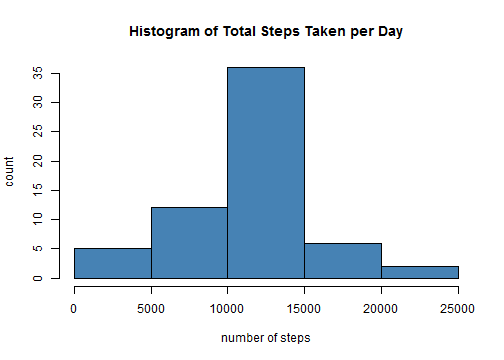
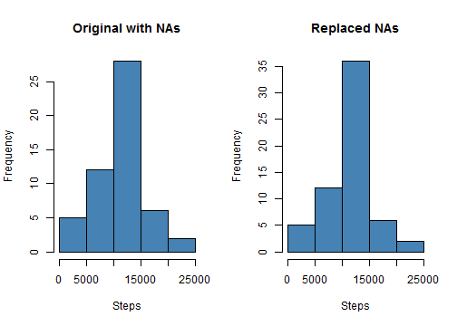
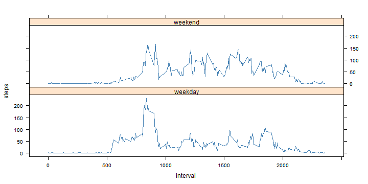

# Reproducible Research: Peer Assessment 1


# Loading and preprocessing the data.
> Clone this repository will include the zipfile of the data used in this analysis. 
> This code will unzip and read the data for you. 


```r
file <- unz("activity.zip", "activity.csv")  ## unzip file
data <- read.csv(file, header = T, colClasses = c("numeric", "character", "numeric"))
## data$interval <- factor(data$interval) data$dat <- as.Date(data$date,
## format = '%Y-%m-%d')
```


# What is mean total number of steps taken per day?

```r
steps <- aggregate(steps ~ date, FUN = sum, data = data)
mean <- round(mean(steps$steps, na.rm = TRUE), 2)
median <- round(median(steps$steps, na.rm = TRUE), 2)

hist(x = steps$steps, xlab = "number of steps", ylab = "count", col = "steelblue", 
    main = "Histogram of Total Steps Taken per Day")
```

 


## The Mean is

```r
mean
```

```
## [1] 10766
```


## The Median is

```r
median
```

```
## [1] 10765
```


# What is the average daily activity pattern?

```r
stepInterval <- aggregate(steps ~ interval, FUN = "mean", data = data, na.rm = TRUE)
plot(steps ~ interval, data = stepInterval, type = "l", col = "steelblue")
```

 


## Which 5-min interval on average across all the days in the dataset contains the max number of steps?

```r
max <- which.max(stepInterval$steps)
stepInterval[max, ]$interval
```

```
## [1] 835
```


# Imputing missing values
## Calculate and report the number of missing values in the dataset (i.e. the total number of rows with NAs)

```r
sum(is.na(data))
```

```
## [1] 2304
```


## Create a new dataset that is equal to the original dataset but with the missing values filled in

```r
new_data <- merge(data, stepInterval, by = "interval", suffixes = c("", ".y"))
na_values <- is.na(new_data$steps)
new_data$steps[na_values] <- new_data$steps.y[na_values]
new_data <- new_data[, c(1:3)]

steps_new <- aggregate(steps ~ date, data = new_data, FUN = sum)
hist(x = steps_new$steps, xlab = "number of steps", ylab = "count", col = "steelblue", 
    main = "Histogram of Total Steps Taken per Day")
```

 


## The new mean and median are

```r
mean(steps_new$steps)
```

```
## [1] 10766
```

```r
median(steps_new$steps)
```

```
## [1] 10766
```


## Do these values differ from the estimates from the first part of the assignment?
> The values differ only by a slight amount. While the mean stayed the same for both 
> observations, after replacing the NA values, we see that the median does change 
> slightly and has moved closer to the mean value. 


```r
par(mfrow = c(1, 2))
hist(x = steps$steps, xlab = "Steps", col = "steelblue", main = "Original with NAs")
hist(x = steps_new$steps, xlab = "Steps", col = "steelblue", main = "Replaced NAs")
```

 


# Are there differences in activity patterns between weekdays and weekends?

## Create a new factor variable in the dataset with two levels - "weekday" and "weekend"
## indicating whether a given date is a weekday or weekend 

```r
new_data$day <- "weekday"
for (i in 1:nrow(new_data)) {
    if (weekdays(as.Date(new_data[i, ]$date)) %in% c("Saturday", "Sunday")) {
        new_data[i, ]$day <- "weekend"
    }
}
```


## Make a panel plot containing a time series plot (i.e. type = "l") of the 5-minute interval 
## (x-axis) and the average number of steps taken, 
## averaged across all weekday days or weekend days (y-axis).

```r
library(lattice)
steps_final <- aggregate(steps ~ interval + day, FUN = "mean", data = new_data)
xyplot(steps ~ interval | day, data = steps_final, type = "l", layout = c(1, 
    2), col = "steelblue")
```

 


